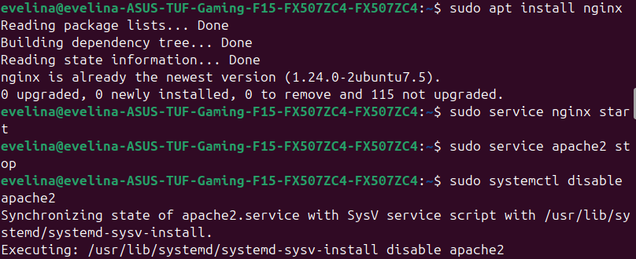
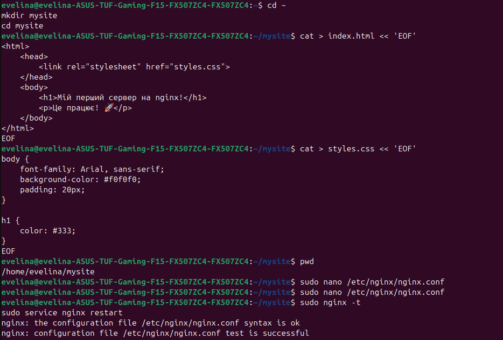
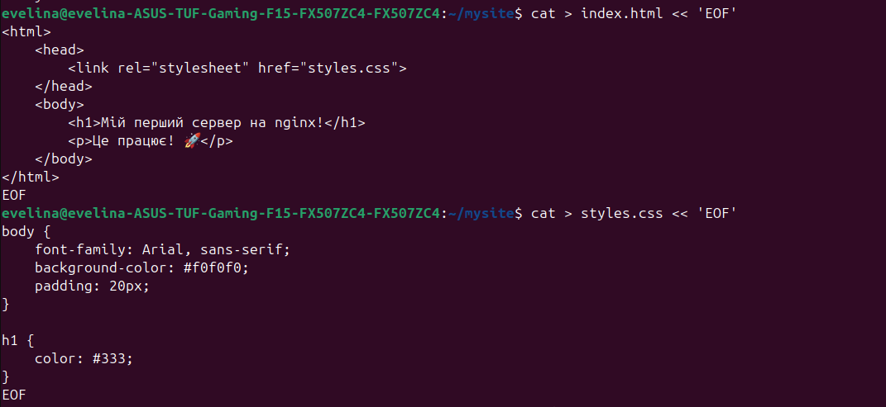
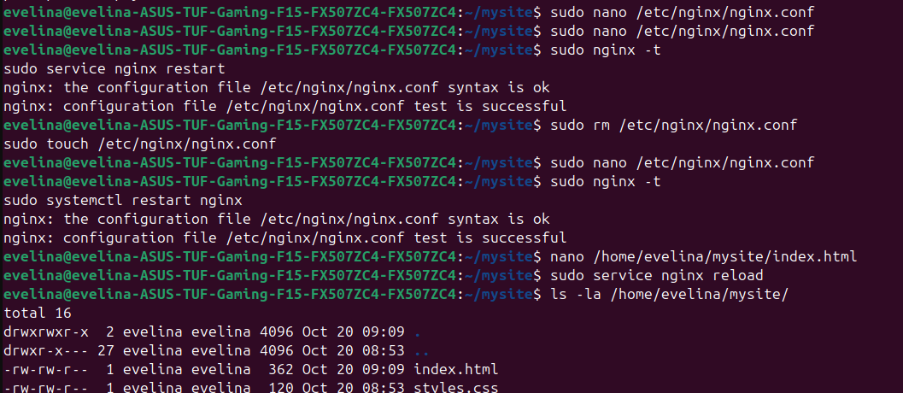
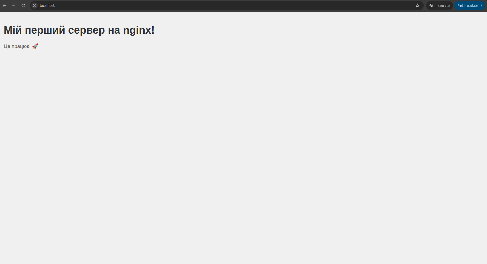
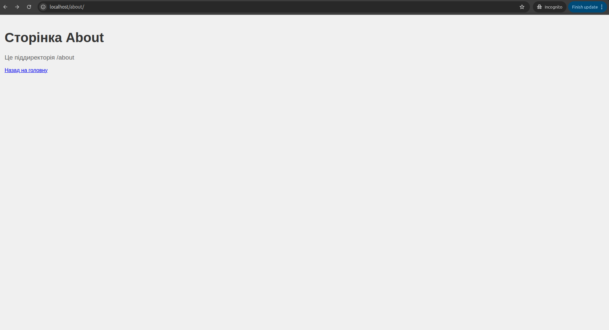
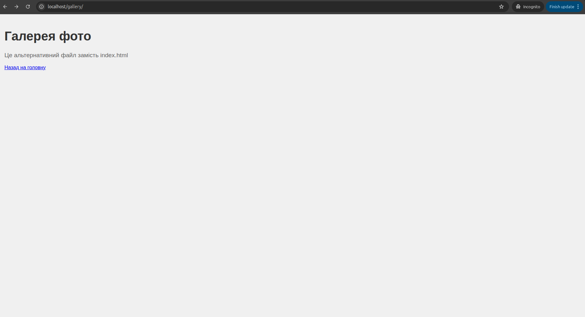
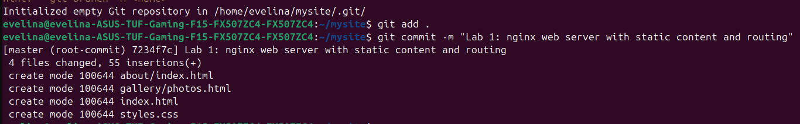
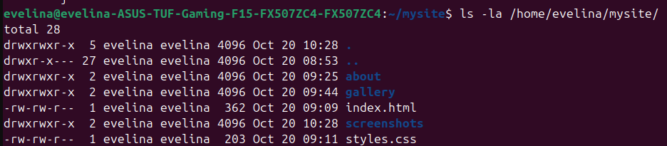

# Лабораторна робота №1. Створення найпростішого веб-сервера на основі nginx

## Студентка: Евеліна  
## Група: ІПЗ-32  

---

## Мета роботи

Ознайомлення з веб-сервером nginx, навчитися встановлювати та запускати сервер, налаштувати відображення статичного веб-сайту з використанням конфігураційних директив та маршрутизацією запитів.

---

## Налаштування середовища

- **ОС:** Linux (Ubuntu)
- **Веб-сервер:** nginx
- **Мова розмітки:** HTML
- **Мова стилізації:** CSS
- **Система контролю версій:** Git

---

# Крок 1. Встановлення nginx

Встановив веб-сервер nginx та перевірив його статус.

**Команди:**
```bash
sudo apt update
sudo apt install nginx
sudo service nginx start
sudo service nginx status
зупинила роботу apache2, тому що на ньому я працюю в проектах на drupal
```

**Результат:**


nginx успішно встановлено та запущено на порту 80.

---

# Крок 2. Створення структури проекту

Створив папку проекту та необхідні файли для веб-сайту.

**Команди:**
```bash
cd ~
mkdir mysite
cd mysite
pwd
```

**Результат структури проекту:**


Папка проекту: `/home/evelina/mysite`

---

# Крок 3. Створення HTML та CSS файлів

Створив файл `index.html` з заголовком та параграфом, а також файл `styles.css` для стилізації.

**Файл index.html:**
```html
<!DOCTYPE html>
<html lang="uk">
<head>
    <meta charset="UTF-8">
    <meta name="viewport" content="width=device-width, initial-scale=1.0">
    <link rel="stylesheet" href="styles.css">
    <title>Мій сервер на nginx</title>
</head>
<body>
    <h1>Мій перший сервер на nginx!</h1>
    <p>Це працює! 🚀</p>
</body>
</html>
```

**Файл styles.css:**
```css
body {
    font-family: Arial, sans-serif;
    background-color: #f0f0f0;
    padding: 20px;
    margin: 0;
}

h1 {
    color: #333;
    font-size: 2.5em;
}

p {
    color: #666;
    font-size: 1.2em;
}
```

**Результат:**


Файли index.html та styles.css успішно створено.

---

# Крок 4. Налаштування конфігурації nginx

Відредагував файл `/etc/nginx/nginx.conf` для налаштування веб-сервера.

**Конфігурація nginx.conf:**
```nginx
user www-data;
worker_processes auto;
pid /run/nginx.pid;

events {
    worker_connections 768;
}

http {
    include /etc/nginx/mime.types;
    default_type application/octet-stream;

    access_log /var/log/nginx/access.log;
    error_log /var/log/nginx/error.log;

    gzip on;

    server {
        listen 80;
        root /home/evelina/mysite;
        index index.html;

        location / {
            try_files $uri $uri/ =404;
        }

        location /about {
            try_files $uri $uri/ =404;
        }

        location /gallery {
            try_files /gallery/photos.html /index.html =404;
        }
    }
}
```

**Перевірка синтаксису:**
```bash
sudo nginx -t
```

**Запуск сервера:**
```bash
sudo service nginx restart
```

**Результат конфігурації:**


Конфігурація nginx успішно налаштована і перевірена.

---

# Крок 5. Тестування головної сторінки

Перевірив роботу головної сторінки за адресою http://localhost/

**Результат:**


Головна сторінка відображається коректно з HTML вмістом та CSS стилями.

---

# Крок 6. Створення піддиректорії about

Створив папку `about` з файлом `index.html` для демонстрації роботи з піддиректоріями.

**Команда:**
```bash
mkdir -p /home/evelina/mysite/about
```

**Файл /about/index.html:**
```html
<!DOCTYPE html>
<html lang="uk">
<head>
    <meta charset="UTF-8">
    <link rel="stylesheet" href="../styles.css">
    <title>Про нас</title>
</head>
<body>
    <h1>Сторінка About</h1>
    <p>Це піддиректорія /about</p>
    <a href="/">Назад на головну</a>
</body>
</html>
```

**Тестування:**


Сторінка `/about/` відображається коректно за адресою http://localhost/about/

---

# Крок 7. Створення піддиректорії gallery з альтернативним файлом

Створив папку `gallery` з файлом `photos.html` (не index.html) для демонстрації директиви `try_files`.

**Команда:**
```bash
mkdir -p /home/evelina/mysite/gallery
```

**Файл /gallery/photos.html:**
```html
<!DOCTYPE html>
<html lang="uk">
<head>
    <meta charset="UTF-8">
    <link rel="stylesheet" href="../styles.css">
    <title>Галерея</title>
</head>
<body>
    <h1>Галерея фото</h1>
    <p>Це альтернативний файл замість index.html</p>
    <a href="/">Назад на головну</a>
</body>
</html>
```

**Тестування:**


Сторінка `/gallery/` відображається коректно за адресою http://localhost/gallery/ завдяки директиві `try_files`.

---

# Крок 8. Завантаження на GitHub

Ініціалізував Git репозиторій та завантажив проект на GitHub.

**Команди:**
```bash
cd /home/evelina/mysite
git init
git add .
git commit -m "Lab 1: nginx web server with static content and routing"
git remote add origin https://github.com/your_username/mysite.git
git branch -M main
git push -u origin main
```

**Результат:**


Проект успішно завантажено на GitHub.

---

# Остаточна структура проекту

**Команда:**
```bash
ls -la /home/evelina/mysite/
```

**Результат:**


**Структура проекту:**
```
/home/evelina/mysite/
├── index.html           # Головна сторінка
├── styles.css           # Стилі
├── about/
│   └── index.html       # Сторінка About
├── gallery/
│   └── photos.html      # Альтернативна сторінка Gallery
├── screenshots/         # Папка зі скріншотами
└── README.md            # Документація
```

---

# Висновок

Лабораторна робота успішно виконана. Я:

Встановила та запустив веб-сервер nginx 
Налаштувала конфігурацію nginx для обслуговування статичного контенту 
Реалізувала роботу з піддиректоріями через директиву `location` 
Використала директиву `try_files` для альтернативних файлів 
Налаштувала MIME типи для коректного обслуговування різних типів файлів 
Завантажила проект на GitHub 

**Веб-сервер успішно функціонує і обслуговує статичний контент на порту 80.**

---

## Посилання

- **GitHub репозиторій:** [https://github.com/evlinges/-.git]
- **Адреса веб-сайту (локально):** http://localhost/

---

**Дата завершення:** 2025-10-20
